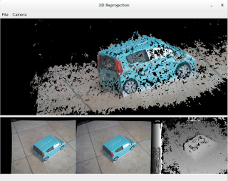

#3D Reprojection From Stereo Image Application
This C++ 11 application construct the 3D polygon from the stereo image that be taken by such as Nintendo 3DS. The 3D construction and the stereo camera calibration are computed by using the OpenCV Library. The point cloud operation and the triangulation are computed by using the Point Cloud Library (PCL).

##Screen Shot

##Dependency
* g++ 4.8.2
* gtkmm 2.24.4
* gtkglextmm 1.2.0
* OpenCV 2.4.8
* Point Cloud Library (PCL) 1.7.1

